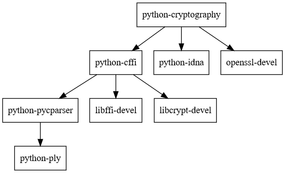

# About

`python-cryptography` dependency graph (excluding build tools and check tools):



# Build

Open `msys2` shell and clone this repository preserving line endings (assuming you have `core.autocrlf=true` in global config):

```shell
git clone https://github.com/mugiseyebrows/msys2-python-cryptography.git --config core.eol=lf
cd msys2-python-cryptography
```

Build and install packages

```shell
sh build-and-install.sh
```